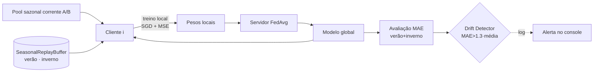

<!--
Apresentação técnica — Concept Drift em Federated Learning para previsão eólica.
Formato: Markdown com separadores `---` (compatível com Marp / Slidev).
Para exportar via Marp, basta adicionar um frontmatter `marp: true` no topo.
-->

# Concept Drift em Federated Learning para Previsão Eólica

### Detector, Corretor Sazonal e o Novo Cenário

Tópicos Avançados de Redes — UFPA
Junho / 2026

---

## 1. Problema: por que falar de Concept Drift?

- **Concept drift** = a relação $f: \text{features} \rightarrow P$ muda ao longo do tempo.
- Em parques eólicos, a mudança é **sazonal e física**:

| Estação | Meses | Vento | Densidade do ar | Geração |
|---------|-------|-------|-----------------|---------|
| Verão (JJA) | Jun, Jul, Ago | mais fraco | menor | menor |
| Inverno (DJF) | Dez, Jan, Fev | mais forte | maior | maior |

- Modelo treinado **offline só com verão** deixa de valer no inverno → previsão degrada.
- Literatura (Bessa et al. 2009) já alerta: vento é não-estacionário, exige treino *online*.

---

## 2. Dataset e setup federado

- 4 parques eólicos: `Location1.csv` … `Location4.csv` → **4 clientes** federados.
- Target: `Power` (potência da turbina) já normalizado em **[0, 1]**.
- Particionamento **cronológico 80 / 20** (treino / teste) por cliente.
- Pools sazonais (`src/config.py`):
  - Verão (A): meses `[6, 7, 8]`
  - Inverno (B): meses `[12, 1, 2]`
- Drift simulado **alternando os pools A ↔ B** durante o treino federado.

---

## 3. Features usadas (15 dimensões)

Construídas em `src/data.py` a partir das colunas brutas:

**6 brutas (meteorológicas)**
`temperature_2m`, `relativehumidity_2m`, `dewpoint_2m`,
`windspeed_10m`, `windspeed_100m`, `windgusts_10m`

**4 trigonométricas (direção do vento)**
`sin/cos(winddirection_10m)`, `sin/cos(winddirection_100m)`
→ remove a descontinuidade em 0° / 360°.

**5 derivadas físicas e temporais**
- `v³_10m`, `v³_100m` — potência ∝ v³ na equação eólica
- `air_density` — proxy via temperatura / dewpoint
- `ρ · v³` — termo físico direto da potência
- `sin/cos(hora)` — ciclo diário

> Justificativa: injetar **prior físico** ajuda o MLP a generalizar entre estações.

---

## 4. Modelo + Federated Learning

**Modelo local** (`src/model.py` — `WindPowerMLP`)

```text
Input  [N, 15]
  └─ Linear(15→64) → ReLU → Dropout(0.2)
  └─ Linear(64→32) → ReLU → Dropout(0.2)
  └─ Linear(32→1)  → Sigmoid     # saída em [0, 1]
```

**Treino federado** (`src/federated_service.py`)

- Loss local: **MSE**, otimizador **SGD**.
- Agregação: **FedAvg ponderado** pelo tamanho do dataset de cada cliente.
- Métrica global de avaliação: **MAE percentual** sobre o pool de teste combinado.

---

## 5. Drift Detector — `DetectorDeDrift`

**Onde:** `src/drift_detector.py`

- **Tipo:** detector heurístico de janela móvel **FIFO** (não é ADWIN/DDM/KSWIN).
- **Sinal monitorado:** **MAE de teste** por rodada federada (não a loss de treino).
- **Hiperparâmetros** (`src/config.py`):
  - `DRIFT_WINDOW_SIZE = 5`
  - `DRIFT_THRESHOLD = 1.3`

**Regra de decisão**

```python
if len(historico_loss) == tamanho_janela:
    media_passada = np.mean(historico_loss[:-1])
    if loss_atual > media_passada * 1.3:
        return True   # drift detectado
```

- **Saída:** `bool` por rodada (alerta no log quando `True`).
- **Papel atual:** **observacional** — registra que houve degradação anômala, mas **não dispara o corretor automaticamente**.

---

## 6. Drift Corrector — `SeasonalReplayBuffer`

**Onde:** `src/seasonal_replay_buffer.py`

**Estrutura**
- 2 *buckets* por cliente: **verão** e **inverno**.
- Capacidade por estação: `REPLAY_BUFFER_SIZE = 500` amostras (`src/config.py`).
- Política de inserção: **fill-up** (preenche em ordem até encher; depois congela o bucket).

**Como entra no treino federado** (`src/scenarios.py`)
1. A cada rodada, o cliente recebe o pool sazonal corrente (A ou B).
2. Em transição de estação, o bucket dessa estação é **alimentado** com amostras atuais.
3. O dataset de treino local vira: `dataset_corrente ⊕ buffer.get_dataset()`
   → o cliente revê **amostras das duas estações**, mesmo numa rodada de inverno puro.

**Garantia federada:** o buffer é **por cliente** (não compartilhado entre Location1…4), preservando o isolamento de dados do FL.

---

## 7. O Novo Cenário — *FL Drift Recorrente (Com correção)*

Três cenários comparados em `src/main.py`:

| Cenário | Drift no treino | Replay buffer |
|---|---|---|
| **FL Padrão** | sem drift (só verão) | — |
| **FL Drift Recorrente** | alterna A/B a cada 4 rodadas | — |
| **FL Drift Recorrente (Com correção)** ← **novo** | alterna A/B a cada 4 rodadas | **ativo (por cliente)** |

**Configuração do drift** (`src/config.py`):
- Drift começa na **rodada 8**.
- **Ciclo de 4 rodadas** alternando pool A ↔ B.
- Avaliação **sempre** no pool combinado (verão + inverno) → mede generalização real.

> O “novo” cenário **junta os três ingredientes**: federação + drift recorrente + correção por replay sazonal.

---

## 8. Fluxo de uma rodada (com correção)



---

## 9. O que o sistema prevê — e por que isso importa

**O que prevê**
- **Potência eólica normalizada** $\hat{P} \in [0, 1]$ a partir das condições atuais (nowcasting tabular, sem janela temporal explícita).

**Utilidade prática (Smart Grid)**
- **Despacho e operação** de sistemas elétricos com alta penetração renovável.
- **Planejamento de reservas** e contratação de energia firme.
- **Integração eólica em mercados** intra-day, onde erros de previsão custam $$.
- **Manutenção preditiva** indireta (desvios sustentados sinalizam mudanças no parque).

> O **federated learning** ainda traz: privacidade dos dados de cada parque, escalabilidade entre operadores e robustez a falhas de um cliente.

---

## 10. O que a correção realmente resolve

**Problema atacado: *catastrophic forgetting* sazonal**

Sem correção, em FL Drift Recorrente:
- O modelo global é **puxado** pelos gradientes do pool corrente.
- Ao entrar no inverno, **esquece** o verão; ao voltar ao verão, **esquece** o inverno.
- O **MAE oscila** a cada troca de estação e a recuperação pós-drift é lenta.

Com `SeasonalReplayBuffer`:
- Cada cliente mantém **memória das duas estações**.
- O gradiente local é calculado sobre dados **mistos** (corrente + replay).
- Resultado esperado:
  - **MAE médio menor** no pool combinado;
  - **Variância** entre rodadas **menor**;
  - **Recuperação mais rápida** após cada troca A↔B.

---

## 11. E se a correção não existisse?

Cenário **FL Drift Recorrente puro** (baseline sem replay):

- Modelo se torna **especialista da última estação vista**.
- Em produção, isso significa:
  - **Erros sistemáticos** quando a estação real diverge da última de treino;
  - **Modelo instável** mês a mês — difícil de validar e auditar;
  - **Operador da rede** recebe previsões viesadas → decisões de despacho erradas.

- Tecnicamente, o detector **registraria** picos de MAE, mas **nada** seria feito automaticamente: o sistema só sabe que “está errando”, não corrige.

> A correção transforma um modelo *reativo e oscilante* em um modelo *com memória sazonal*.

---

## 12. Limitações honestas e próximos passos

**Limitações do projeto atual**
- Detector é **heurístico** (média ± fator), sem teste estatístico; janela curta (5).
- Detector e corretor são **desacoplados** — replay é ligado por *flag* de cenário, não por evento de drift.
- Buffer usa política **fill-up**; não há *reservoir sampling* nem decaimento.
- **Sem horizonte futuro explícito**: prediz `Power` do mesmo instante (nowcasting).
- Resultados numéricos finais (MAE por cenário) **não estão salvos** no repositório — apenas o gráfico `fl_wind_drift_results.png` e o resumo em runtime.

**Próximos passos naturais**
1. Substituir o detector por **ADWIN** ou **KSWIN** (`river`).
2. **Acoplar** detector → corretor (replay disparado por evento).
3. Reservoir sampling no buffer + buffer compartilhado seguro (DP-FedAvg).
4. Estender para **previsão multi-horizonte** com janela temporal.

---

## 13. Resumo

- **Problema:** previsão eólica sob *concept drift* sazonal em ambiente federado.
- **Detector:** janela móvel sobre MAE; alerta quando `MAE > 1.3 × média`.
- **Corretor:** `SeasonalReplayBuffer` por cliente, 500 amostras/estação, treino local em `corrente ⊕ replay`.
- **Novo cenário:** FL Drift Recorrente **+** correção por replay sazonal.
- **Ganho conceitual:** combate *catastrophic forgetting* → MAE mais baixo e mais estável entre estações.

### Obrigado — perguntas?
